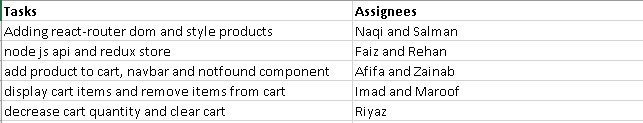

# Resources Required

1. [node.js](https://nodejs.org/en/)
2. [React.js](https://reactjs.org/)
3. [MongoDB](https://www.mongodb.com/cloud/atlas/lp/try4?utm_source=google&utm_campaign=search_gs_pl_evergreen_atlas_core_prosp-brand_gic-null_apac-in_ps-all_desktop_eng_lead&utm_term=mongodb&utm_medium=cpc_paid_search&utm_ad=e&utm_ad_campaign_id=12212624347&adgroup=115749713423&gclid=EAIaIQobChMI3dv9kJCa-gIVTZlmAh2owQNCEAAYASAAEgLjWfD_BwE)
4. [Express.js](https://expressjs.com/)

# Accounts

1. MongoDB

```
epicd3055@gmail.com
Epic12Database#
```

2. Cloudinary

```
epicd3055@gmail.com
Mobo12Kart#
```

# Contribution


